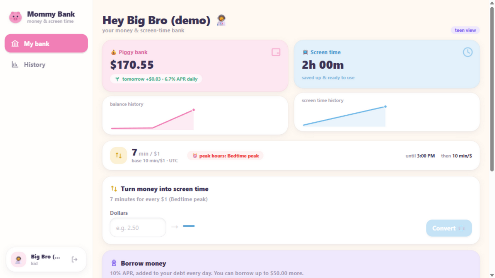
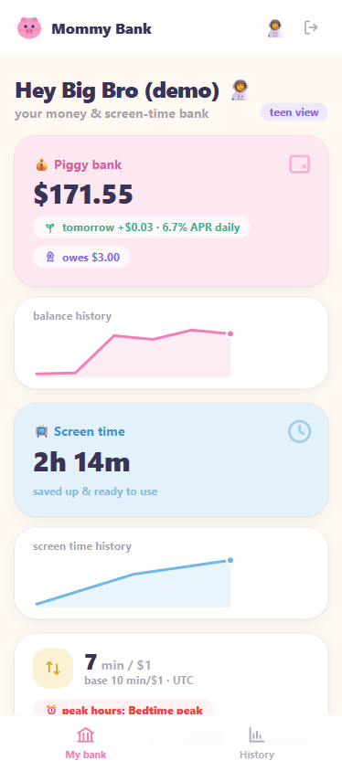

# Mommy Bank 🐷

A family bank where the currency is **money** and **screen time**. Parents run the
bank; kids watch their savings grow (and occasionally convert dollars into
minutes, or borrow against their future allowance).

   

**Desktop — the teen dashboard** (balances, sparklines, live peak/off-peak exchange rate, convert & borrow):



**Mobile — same kid, same bank, on a phone** (bottom tab bar, stacked cards):

<p align="center">
  
</p>

## What's inside

- **Money bank** — deposits, withdrawals, daily compound interest (default **6.7% APR**), full append-only ledger.
- **Screen-time bank** — grants/deductions and **money→time exchange** (default **$1 = 10 minutes**) with **peak / off-peak rules** (e.g. bedtime = 7 min/$, weekend mornings = 15 min/$ — all parent-configurable, weekday/weekend + intra-day windows, cross-midnight supported).
- **Borrowing** (off by default, **10% APR** daily compounding, debt cap) with per-kid permission.
- **Three age modes** — `teen` (charts & tables), `kid` (big friendly buttons), `toddler` (giant numbers + sticker chart).
- **Three equal surfaces** — responsive web GUI, `mommybank` CLI, and an MCP server for AI agents. Everything the GUI can do, the CLI and MCP can do.
- Docker single-container deployment; ready to sit behind Cloudflare Access with Gmail login on EC2 (see [plan/deployment.md](plan/deployment.md)).

## Quick start (local dev)

```bash
# 1. backend  → http://127.0.0.1:8971  (docs at /docs)
cd backend
python -m venv .venv
.venv/Scripts/pip install -e ".[dev]"        # Linux/macOS: .venv/bin/pip
MOMMYBANK_ADMIN_PASSWORD=pick-a-password MOMMYBANK_SEED_DEMO=1 MOMMYBANK_DEMO_PASSWORD=pick-demo-pw \
  .venv/Scripts/python -m uvicorn mommybank.main:app --port 8971 --reload
#   (omit the password env to get a random one printed once; SEED_DEMO adds teen/kid/toddler demo accounts)

# 2. frontend → http://localhost:5173 (proxies /api to the backend)
cd frontend
npm install
npm run dev
```

Open **http://localhost:5173** and log in. Data lives in `backend/data/mommybank.db` — delete it for a factory reset.

> Port 8971 is used because 8000 is often taken; change both `--port` and the proxy target in `frontend/vite.config.ts` if you prefer another port.

## Docker

```bash
docker compose up --build -d      # → http://localhost:8971
```

One container: node builds the SPA → python image serves API + SPA on port 8000
(mapped to host 8971). SQLite persists on the `./data` volume. On first boot set
`MOMMYBANK_ADMIN_PASSWORD` in `.env` (see `.env.example`); if unset, a random
admin password is printed **once** to the container logs
(`docker compose logs mommybank | grep password`).

## CLI

```bash
cd backend
export MOMMYBANK_URL=http://127.0.0.1:8971
.venv/Scripts/python -m mommybank.cli login admin          # or mommybank.exe in .venv/Scripts
.venv/Scripts/python -m mommybank.cli overview
.venv/Scripts/python -m mommybank.cli deposit teen --amount 20 --note allowance
.venv/Scripts/python -m mommybank.cli convert teen --dollars 2
.venv/Scripts/python -m mommybank.cli quote                # current exchange rate + rule
.venv/Scripts/python -m mommybank.cli set-setting savings_apr_percent 8.0
.venv/Scripts/python -m mommybank.cli add-rule "Homework hour" --days 0,1,2,3,4 --start 16:00 --end 17:00 --rate 20
```

Full command list: [plan/api.md](plan/api.md).

## MCP server (for AI agents)

```bash
export MOMMYBANK_URL=http://localhost:8971 MOMMYBANK_USERNAME=admin MOMMYBANK_PASSWORD=…
python -m mommybank.mcp_server     # stdio transport
```

Client config snippet + tool list: [plan/api.md](plan/api.md#mcp-server).

### …or install the ZCode plugin (marketplace format)

This repo doubles as a **plugin marketplace**: `.claude-plugin/marketplace.json`
lists the [`plugins/mommy-bank`](plugins/mommy-bank/) plugin, which bundles the
`mommybank` MCP server **plus** the `mommy-bank-control` skill — an operator
manual that teaches any AI agent how to run the bank (units, permissions,
recipes, gotchas).

**Install**: ZCode → Settings → Plugin Management → Discover → **+** → add
`https://github.com/hevangel/mommy_bank` → **Get** on *mommy-bank*. Requires the
`mommybank` package importable (`pip install ./backend`) and the bank running.
Details: [plugins/mommy-bank/README.md](plugins/mommy-bank/README.md).

## Tests & QA

```bash
cd backend  && .venv/Scripts/python -m pytest      # 68 tests
cd frontend && npm test && npm run build           # 19 tests + type-check + bundle
```

Browser QA report (13 scripted GUI test points, screenshots): [qa/QA_REPORT.md](qa/QA_REPORT.md).

## Docs

Everything lives in [`plan/`](plan/): master plan, architecture, database schema,
API/CLI/MCP reference, UX design, testing strategy, and the EC2 + Cloudflare
(Gmail login) production guide.

## Contributing

This is an **AI-implemented, human-directed** open-source project: humans open
issues, review, and merge; AI agents write the code. Standard PR process — see
[CONTRIBUTING.md](CONTRIBUTING.md), and [`AGENTS.md`](AGENTS.md) if you're the
AI agent doing the implementing.

## Security notes

- Passwords are bcrypt-hashed; sessions are JWT (secret from env or auto-generated per install). No credentials are hard-coded anywhere — first-run admin password comes from env or is generated and printed once.
- All SQL is parameter-bound via SQLAlchemy. The Cloudflare Access JWT hook (production Gmail login) is off by default and validates the team domain against a strict allowlist.
- This is a family tool: single-process SQLite, no rate limiting — keep it behind your own auth layer (Cloudflare Access/Tailscale) if exposed to the internet.
